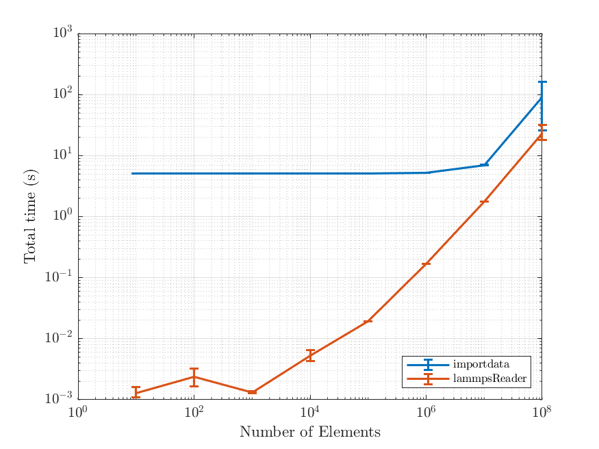

# LAMMPS Reader

This script reads a LAMMPS dump output file into a MATLAB structure variable with a header data in the *textdata* field and numerical data in the *data* field. It is intended to be more efficient than in-built functions (e.g. `importdata`) by utilising low-level functions (i.e. `textscan`) and pre-allocating the size of the data field from the header data.

## Setup

The repository can be cloned and source directory added to the MATLAB path using the `addpath` command. An example is given below:

``` matlab
addpath('~/Documents/MATLAB/LAMMPS_Reader/')
```

## Usage

The function can be called using the following command:

``` matlab
file = lammpsReader('example.dump');
```

Further details on the optional input parameters and output structure variable are provided in the main script `lammpsReader.m` and an example case is provided in the example directory.

## Performance

The performance directory contains the script `makeDumpFiles.m` which will create set of dummy dump files with increasing number of rows. This allows the performance of `lammpsReader.m` to be tested using the script `checkPerformance.m` which will compare against in-built functions (e.g. `importdata`). The performance test can be executed as follows:

``` matlab
cd performance
makeDumpFiles
checkPerformance
```

This will generate a figure showing the speed-up obtained from using `lammpsReader.m`, an example of which is shown below.




## Authors

* **Adnan Sufian** - email: [a.sufian@imperial.ac.uk](a.sufian@imperial.ac.uk)

## License

This project is licensed under the MIT License - see the [LICENSE.md](LICENSE.md) file for details.
